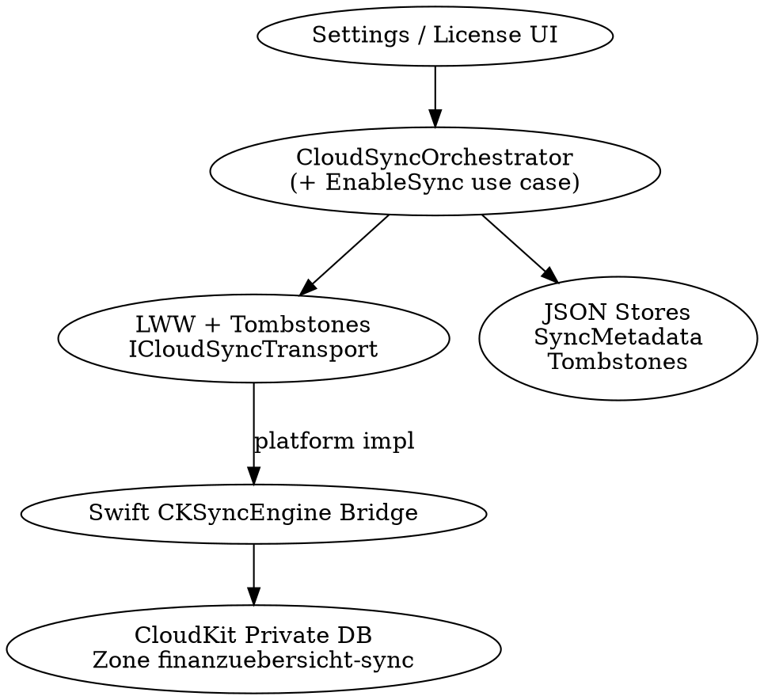

# CloudKit Sync MVP — Design

**Date:** 2026-08-07  
**Related issues:** [#243](https://github.com/Thomas-Menzl-Softwareentwicklung/finanzuebersicht/issues/243) (feature), [#300](https://github.com/Thomas-Menzl-Softwareentwicklung/finanzuebersicht/issues/300) (persistenz prep)  
**Status:** Approved for documentation; implementation deferred  
**Branch:** `docs/cloudkit-sync-mvp-design`

## Goal

Optional iCloud/CloudKit sync between iPhone, iPad, and Mac (same Apple ID), offline-first, behind the existing Sync subscription gate. First shippable slice: architecture blueprint + MVP entity set — not the full long-term sync product.

## Decisions (locked)

| Topic | Choice |
|-------|--------|
| Scope of this design | Architecture + MVP slice (not full product in one go) |
| Synced data | Accounts, categories, transactions, recurring (+ embedded exceptions), savings goals (`SparZiel`) |
| Conflict rule | Last-write-wins per entity (`UpdatedAt`) |
| Deletes | Tombstones with timestamp |
| Sync cadence | Auto: app start / foreground + debounced after local writes + CloudKit push |
| First enable | Allowed only if Cloud is empty **or** local sync data is empty; otherwise block with guidance |
| Transport | Apple `CKSyncEngine` + one `CKRecord` per entity via Swift bridge |
| OS gate | Sync feature requires iOS 17+ / Mac Catalyst (macOS 14+); app may keep lower overall minimum |
| Out of MVP | Budgets, settings, widget presets, field-level merge, dual-device merge when both have data, shared/family DB, Windows/Direct sync |

## Context

- Local persistence today is JSON stores (Clean Architecture + MVVM). No CloudKit code in tree.
- Licensing already models Sync as a yearly IAP (`CanUseCloudSync`, `IsCloudSyncImplemented`, Direct builds never get Cloud Sync). See `docs/MONETIZATION.md`.
- `#300` prepares optional `ExternalId` / `Source` fields before any sync pipeline. Entities currently lack `UpdatedAt`.
- Existing Swift bridge pattern (WidgetKit) is the template for a CloudKit transport bridge.

## Architecture

```text
Presentation (Settings: enable/disable, status, first-enable blocker)
        ↓
Application (EnableSync / orchestrator use cases)
        ↓
Core (ICloudSyncTransport, sync DTOs, LWW + tombstone rules)
        ↓
Infrastructure (JSON entity stores + SyncMetadataStore + tombstone store)
        ↓
Platform (Swift CKSyncEngine bridge) ── CloudKit Private Database
```

**Ownership**

- **C#** owns domain rules: entity↔record mapping, LWW, tombstones, first-enable guard, write debounce, license/OS gates.
- **Swift bridge** owns transport only: custom zone, push registration, `CKSyncEngine` send/fetch, iCloud account status.
- **Local JSON remains** the source of truth on device — no Core Data migration.
- **Windows / Direct builds:** stub transport; Cloud Sync unavailable (`IsCloudSyncImplemented` stays false / platform stub).

### Layer diagram



## Components & data model

### Synced entities (MVP)

`Account`, `Category`, `Transaction`, `RecurringTransaction` (with embedded `RecurringException` list), `SparZiel`.

Locally, exceptions live inside `RecurringTransaction.Exceptions` (`recurring.json`). The MVP syncs them as part of the parent `RecurringTransaction` CloudKit record (bump parent `UpdatedAt` on exception changes) — no separate `RecurringException` record type. `TransactionTemplate`, `CategoryBudget`, and settings remain out of MVP.

### Per-entity fields (local + cloud)

| Field | Role |
|-------|------|
| `Id` | Stable local GUID; used as CloudKit `recordName` |
| `UpdatedAt` | UTC timestamp for LWW (new; required for sync) |
| `ExternalId` / `Source` | From `#300`; `Source=CloudKit` when synced |
| Payload | Existing domain fields unchanged in meaning |

### Tombstones

- Store: `sync-tombstones.json` (or equivalent via `#290` naming).
- Shape: `{ entityType, id, deletedAt }`.
- Retention: keep long enough for multi-device catch-up (e.g. 90 days), then garbage-collect after successful push acknowledgment strategy is in place.
- Cloud record type: `Tombstone`.

### CloudKit layout

- **Database:** private (per Apple ID).
- **Zone:** custom zone `finanzuebersicht-sync`.
- **Record types:** `Account`, `Category`, `Transaction`, `RecurringTransaction`, `SparZiel`, `Tombstone`.
- **Schema meta:** `SyncMeta` record with `schemaVersion`. If cloud schema is newer than the app understands → pause sync and prompt to update the app.

### C# building blocks

| Component | Responsibility |
|-----------|----------------|
| `ICloudSyncTransport` | Start/stop, enqueue upsert/delete, surface fetch events, account status (platform) |
| `ISyncMetadataStore` | Enabled flag, last sync time, pending ops, schema version seen |
| `CloudSyncOrchestrator` | Apply remote with LWW; queue local writes; first-enable checks |
| Settings binding | Wire to existing Sync entitlement labels; set `IsCloudSyncImplemented = true` only for Store + Apple OS ≥ gate |

### Native bridge

- Small Swift library (same packaging idea as WidgetKit bridge).
- Narrow ObjC/C API consumed from .NET iOS / Mac Catalyst.
- Entitlements: iCloud (CloudKit container) + remote notifications (required by `CKSyncEngine`).

## Flows

### First enable (Settings)

1. **Gates:** Store distribution, Sync subscription (`CanUseCloudSync`), OS ≥ iOS 17 / macOS 14 equivalent, iCloud account signed in.
2. **Guard:** Cloud zone empty **XOR** local synced entity set empty. If both have data → block with copy pointing to backup/export and using an empty device or empty cloud.
3. **Cloud empty, local has data** → upload all MVP entities (no tombstones needed for initial seed unless local deletes already tracked).
4. **Local empty, cloud has data** → pull records and populate JSON stores.
5. Persist `SyncEnabled` and start the orchestrator.

### Steady-state sync

- **Local write:** persist as today → set `UpdatedAt = UtcNow` → enqueue upsert (debounce ~1–2s) → bridge `sendChanges`.
- **Local delete:** write tombstone → remove entity from store → enqueue delete/tombstone record.
- **Remote change:** push or foreground fetch → bridge events → orchestrator: create if missing; if present apply LWW on `UpdatedAt`; if tombstone, delete local if still present.
- **App start / foreground:** `fetchChanges` + flush pending `sendChanges`.

### UI

- Settings status only: last synced / syncing / offline / error.
- Booking/transaction UI must not block on sync.

### Idempotency

- `recordName == Id`.
- Duplicate events overwrite only when incoming `UpdatedAt` is newer.

## Error handling

| Case | MVP behavior |
|------|----------------|
| No iCloud / system iCloud Drive off for app | Orchestrator dormant; UI explains iCloud required |
| Sync subscription expired | Pause sync; local app keeps working; prompt to renew |
| Offline | Keep pending queue; retry on foreground / next write |
| Cloud schema newer than app | Pause sync; “update the app” |
| Partial send failure | Leave failed records pending; continue others |
| Apple ID change | Stop sync; warn; do not auto-merge another account’s cloud |

**Privacy:** Sync only after explicit opt-in. Store/privacy copy: data lives in the user’s private iCloud; no first-party sync server.

## Testing strategy

| Layer | Coverage |
|-------|----------|
| Unit (C#) | LWW matrix, tombstone apply, first-enable guard (both populated → reject), debounce/idempotent queue — fake `ICloudSyncTransport` |
| Integration | Orchestrator + in-memory stores + simulated remote events |
| Manual / devices | Two devices, same Apple ID: create/update/delete; offline→online; enable blocker |
| Bridge | Smoke where feasible; push-driven sync needs real devices (Simulator limitations) |

Not in MVP test scope: field merge, dual populated merge, Windows.

## Prerequisites & sequencing

1. Complete relevant v1.20 groundwork as needed; **`#300` must land** (at least `ExternalId`/`Source`, plus **`UpdatedAt`** and tombstone storage agreed here — extend `#300` or a follow-up prep issue).
2. Implement Swift `CKSyncEngine` bridge + entitlements (Store Apple targets only).
3. Implement C# orchestrator, metadata store, Settings enable UX, flip `IsCloudSyncImplemented` when ready.
4. Device QA → App Store notes / privacy updates when shipping Sync IAP for real (`docs/MONETIZATION.md` phase 2).

Implementation is **intentionally deferred**; this branch documents the design only.

## Non-goals (explicit)

- Replacing JSON with Core Data / `NSPersistentCloudKitContainer`
- Sync on Windows or Direct/GitHub builds
- Open Banking (`#245`) — separate; may share `ExternalId`/`Source` later
- Display Home Screen widget (`#242`) — unrelated to CloudKit sync

## Open points resolved in brainstorming

- `CKSyncEngine` is Apple’s official CloudKit API (WWDC 2023), not a third-party library.
- Raising the **app-wide** minimum OS is not required; gate the **Sync feature** instead.
